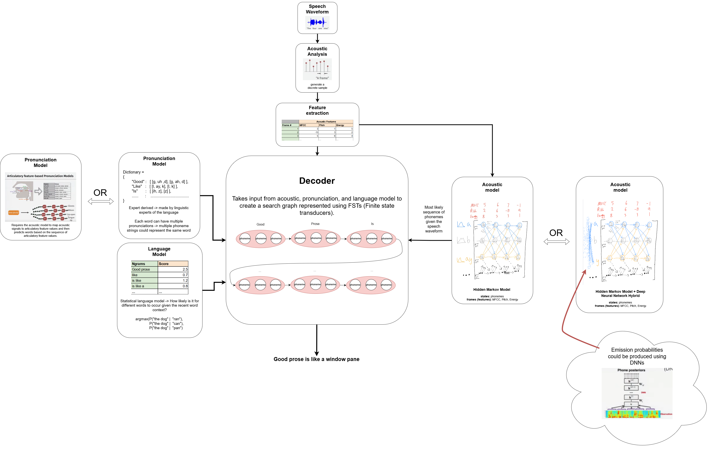

## Motivation 

I recently completed my first semester at Georgia Tech in which I took the AI course offered by Thad Starner. Instead of moving right into another course for the summer semester I decided to use this summer to apply what I learned to a personal project. 

The most interesting topic I thought we covered was the use of Hidden Markov Models (HMMs) and how they can be used for speech recognition. 

## Before I even got started 

[Hidden Markov Models wikipedia](https://en.wikipedia.org/wiki/Hidden_Markov_model)

[The idea of a probability distribution](https://mathinsight.org/probability_distribution_idea)

- [The idea of a probability density function](https://mathinsight.org/probability_density_function_idea)

- [Random variable definition](https://mathinsight.org/definition/random_variable)

## Understanding the architecture

Hidden Markov Models are a part of ASR systems but what is their role? It turns out that the machine learning archiecture for an ASR is much more than just an HMM.

After scouting for some resources on ASR system's I came across [Preethi Jyothi's Automatic Speech Recongition overview](https://www.youtube.com/watch?v=q67z7PTGRi8&t). This helped me understand the various pieces that come together to produce inference on a speech wave. I went through and did a thourgh mapping of the archtecture but unfortunately towards the end of the overview it was expressed that this architecture is outdated. All I can say is it helped me build a better intuition for understanding machine learning models. 

## How to develop a personal project

As an engineer the correct approach to building a car would be to start with roller blades, then make a scooter, then a bike, then a car. 

I've fallen into the temptation (like I assume many of you reading have as well) to want the car right away. After many half-built projects I am doing my best to listen to my cost function and strive for minimum viable products. That being said I wanted to build an ASR system from scratch but in reality it would be better to use this as a learning process and create something simple or use some out of the box options. 

After researching for open source speech recongition toolkits I decided to use Kaldi. 

## Kaldi

A "recipe" refers to a  set of scripts and configurations used to process and train speech recongition models. These recipes outline the steps and parameters requried for tasks such as data preperation, feature extraction, model traning and evaluation. 

I originally went through the [Kaldi tutorial](https://kaldi-asr.org/doc/tutorial.html) by the end of which I realized that I would need access to the [Linguistic Data Consortium](https://www.google.com/url?sa=t&source=web&rct=j&opi=89978449&url=https://www.ldc.upenn.edu/&ved=2ahUKEwjh6abYivCGAxV6LtAFHVl4ALcQFnoECCEQAQ&usg=AOvVaw35KPB-K2haabfWIZSw5eQE), which costs more than $1000 to have a membership to if your institution does not provide you access. This was not a total time sink as there was a subsequent and appropriately named [Kaldi for dummies tutorial](https://kaldi-asr.org/doc/kaldi_for_dummies.html) which is a much more straight forward approach to getting Kaldi setup but with the caveate that you must provide your own data. So that was my first task, find some data. 

## 

 
### references 

1. https://www.youtube.com/watch?v=q67z7PTGRi8&t 
2. https://en.wikipedia.org/wiki/Hidden_Markov_model 
3. https://mathinsight.org/probability_distribution_idea 