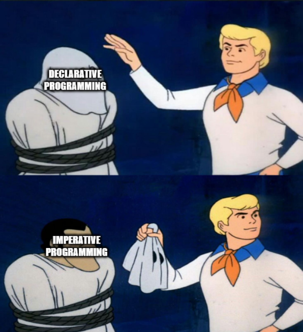

# Distilled defintions 

### Imperative programming
Explicity writing instructions on how to accomplish a task.

```C++
int numbers[5] = {1,2,3,4,5};
int sum = 0;
for(int i = 0; i < 5; i ++)
{
    sum += numbers[i];
}
std::cout << sum << std::endl;
```
If I can trace through the execution of the program it is imperative.

### Declarative programming 
Using a function call that abstracts away how to accomplish a task with the specific call to what should be accomplished 

```typescript
const numbers = [1,2,3,4,5];
const sum = numbers.reduce((prev_value, curr_value) => prev_value + curr_value, 0);
console.log(sum);
```

If my program uses an abstraction such as calling the reduce function to accomplish a specific goal it is declarative. I am declaring what should happen instead of defining how it should happen. 


Many (if not all) declarative APIs have some sort of underlying imperative implementation *scooby do unmask meme*



Declarative can be context independent. In my own words it is a context (state) free abstraction. 

`TBD: Insert code snippets` 

# What about functional

Definition: Functional programming is a paradigm where computation is treated as the evaluation of mathematical functions and avoids (changing state and mutable data).  

Chain method calls: Each method in a chain returns an object, suually the original object, allowing the next method to be called on it.

Fluent interface pattern: Aims to improve the readability by chaining method calls in a way that reads like a sentance.

## What is the difference between functional and declarative? 
