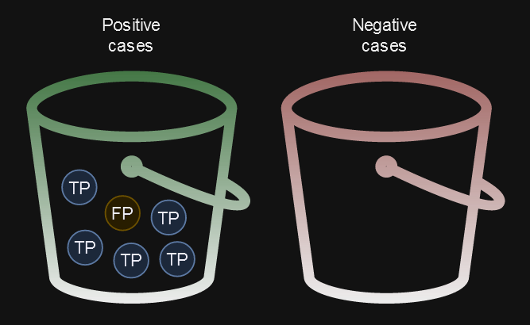
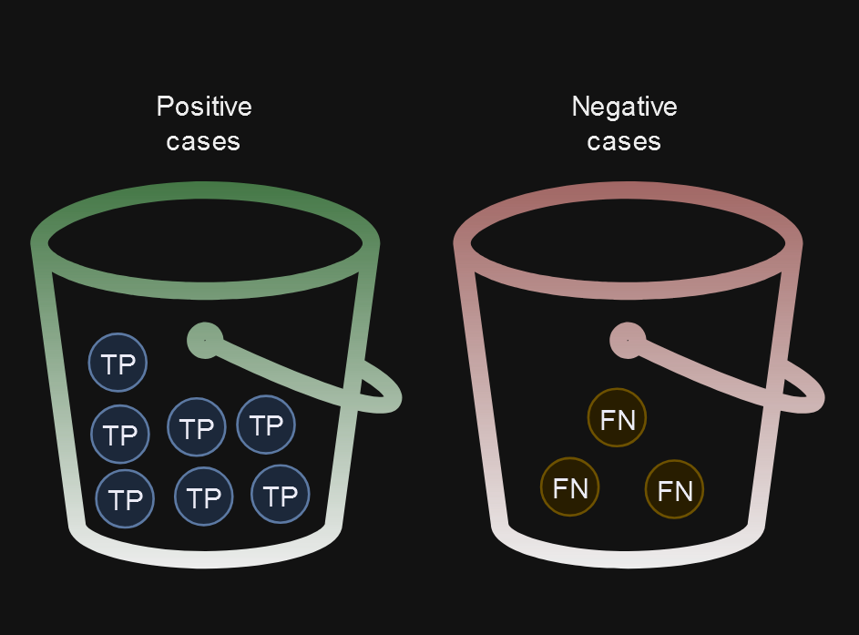

## Percision, Recall, and Accuracy ... why non of these click at first

### Muddy water and nuclear missles 

It was one afternoon my friend [Jaylen](https://www.linkedin.com/in/jaylen-brown-6a70511a3/) and I we were studying for our [AI](https://omscs.gatech.edu/cs-6601-artificial-intelligence) exam when the dreaded topic of percision, accuracy and recall once again came up. This is one of those concepts that I've learned before and it seems that it never wants to cement into my brain. This time Jaylen and I found a good example to help build our intuition. Talking in terms of muddy water and nuclear missles we came up with another way to understand these *(like most things in academia)* dreaded and poorly named measures. '

### Primer 

- True Positive (TP): The result was correctly predicited as positive  
- False Positive (FP): The result was incorrectly predicted as positive 
- True Negative (TN): The result was correct predicted as negative 
- False Negative (FN): The result was incorrectly predicted as negative

### Percision

Let's start with an example and then move onto the details. Let's say we have a model that is trained to detect :artificial_satellite: when a nuclear missile :rocket: is fired towards it and upon detection it will fire a nuclear missle back. 

Now we want to be absolutely sure that when that model detects a positive case of a missile coming towards it is ACTUALLY a missile coming towards it and not something like a bee or baseball flying through the air. 

If we wanted to measure the quality of it identifying a True Positive case (a case where the result is positive and it is ACTUALLY positive) then percision would be a great measure for this.

$$
Percision = \frac{TP}{TP + FP}
$$

As shown by equation percision deals only with **True Positives** and **False Positives**.

We can distill this down to "What is the quality of the positive predictions my model is making?.

Imagine that we had two buckets of water. One for positive cases and one for negative cases. Having either False Positives in the Positive cases bucket or False Negatives in the Negative cases bucket would "muddy the water" of our buckets. 

We would like our model to be making buckets that are completey clear which would ideally be buckets where all the positive cases, that are actually positive (True Positive), are in the positive cases bucket, and all the cases that are actually negative (True Negative), are in the Negative cases bucket. 

Percision is a measure of how muddy the water is for our positive cases bucket. In this example we have a percision of 83% meaning our model captures the actually positive cases 83% of the time and 17% of the time it will mark cases that were actually negative as positive. 

Percision - a measure of the quality of our positive cases. 

When the cost of a false positive is high, make sure that the model has a high percision!
### Recall

Let's add to our nuclear missle scenario to make sure we can understand the difference between Recall and Percision, as they are quite similar. 

Image now that we had a powerful missile interception defence system and that it also utilizes a machine learning model to detect incoming missles but instead of firing a missle back it fires a high power lazer which essentially neutralizes an incoming missle with no other consequences. 

Since the our main goal is to capture all **relevant cases** we would want a model that has a high recall. 

This term **relevant cases** is used when talking about recall and it was not intuitive to me at first so I will help to define here. A case is relevant if it is considered one of the cases that we are trying to identify. For example our relevant case here is when there is ACTUALLY a missle being fired. An irrelevant case would be an instance where a bird is flying through the air. We would hope that our model would identify this as a negative case since it does not involve a missle, hence it is irrelevant.    

$$
Recall = \frac{TP}{TP + FN}
$$

This equation deals only with **True Positives** and **False Negatives**. 

We can distill this down to "How reliable is my model at capturing the cases we are trying to identify?".

Back to our buckets. Having a high recall means we would want there to be the least amount of mud in the negative cases bucket but having the positive cases bucket filled with clear water can make up for it. 

Recall is a measure of how full our positive bucket is with clear water in comparison to how much mud is in the negative cases bucket. In this example we have a recall of 70% meaning that given 100 ACTUAL missles were fired our model would identify 70 of them and destroy them in air. The other 30 it would incorrectly assume are irrelevant cases. In our case of the missile interception defence system this amount of recall would most likely be unacceptable. 

### Accuracy 

Now it seems that we would ideally want a model to have both high recall and high percision or in other words we would have an overall well balaned model. Accuracy can be a helpful metric in this case as it is a measure of the overall correctness of the model. 

Imagine we had a news station that is reporting on this missle mayham that seems to be going on between us firing missles and zapping incoming missles in the sky. This news channel is concered with reporting to it's viewers how our defence systems are doing. It takes into account how many relevant cases of actual missles are detected by the defence system and how many irrelevant cases such as bees, birds, etc are correctly identified. 

Given there a 1000 objects in the sky and 10 are missiles, the other 990 are birds, bees, etc. Our missle detection system identifies 8 out of the 10 missles as relevant cases and 980 out of 990 of the other non-missle objects as irrelevant cases. 

$$
Accuracy = \frac{TP + TN}{TP + TN + FP + FN}
$$

Using our forumla for accuracy the news station would report that our missle defence system has an accuracy of 98% ! That sounds outstanding but in reality this is misleading since even missing 1 missle could be devestating. While accuracy can be a good measure, taking the dataset into consideration and the goal of the model this can distort our view. 

This makes a good case for using percision and recall depending on the application of the model as we discussed previously with firing back a missile or simply intercepting one. 

## BONUS: F1 score 

 